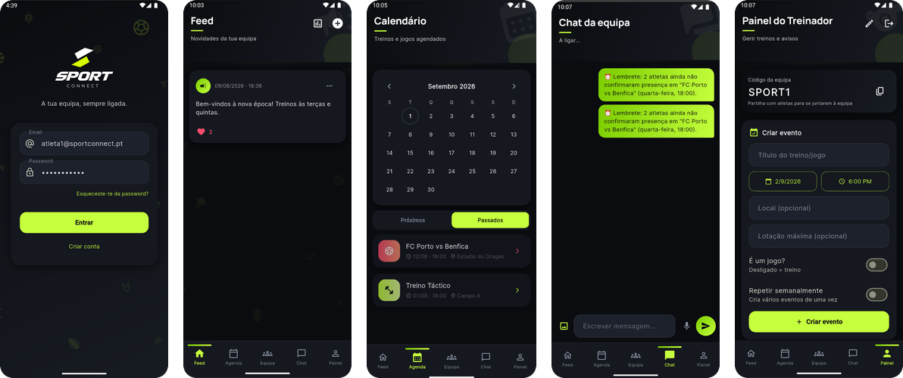

<div align="center">


# SportConnect

**A tua equipa, sempre ligada.**

Plataforma de gestão de equipas desportivas amadoras — aplicação móvel em Flutter
com comunicação em tempo real, sobre uma API REST em Node.js/TypeScript.

[](https://github.com/BernardoSavila/SportConnect/actions/workflows/ci.yml)




</div>

---

## Índice

- [Sobre o projeto](#sobre-o-projeto)
- [Funcionalidades](#funcionalidades)
- [Arquitetura e stack](#arquitetura-e-stack)
- [Estrutura do repositório](#estrutura-do-repositório)
- [Como correr o projeto](#como-correr-o-projeto)
- [Testes](#testes)
- [API](#api)
- [Notificações push / Firebase](#notificações-push--firebase)
- [Percurso do projeto](#percurso-do-projeto-projeto-i--projeto-ii)
- [Roadmap](#roadmap)
- [Autores](#autores)

---

## Sobre o projeto

Equipas amadoras gerem-se hoje espalhadas por três sítios diferentes: um
grupo de WhatsApp para avisos, uma folha de Excel para presenças e
estatísticas, e um calendário à parte sem nenhuma ligação a quem confirmou
o quê. O **SportConnect** junta tudo isto num único ecossistema —
comunicação, calendário e evolução do atleta — com três perfis bem
definidos:

- **Atleta** — confirma presenças, consulta o calendário, comunica com a
  equipa (chat de grupo, mensagens privadas, sondagens) e acompanha a sua
  própria evolução (estatísticas, conquistas, ranking).
- **Treinador** — cria e gere eventos, publica avisos, atribui pontos,
  regista estatísticas de jogo e tem acesso aos contactos de emergência da
  equipa.
- **Admin** — supervisiona a equipa, mantém a ficha institucional e a
  do treinador atualizadas, regista o histórico de treinadores ao longo do
  tempo, e gera o relatório geral da época.

Desenvolvido como projeto académico (Licenciatura em Engenharia
Informática, IPCB/ESTCB), ao longo de dois semestres — **Projeto I**
(fundações e protótipo) e **Projeto II** (implementação completa).

## Funcionalidades

<table>
<tr><td valign="top" width="50%">

**Autenticação e conta**
- Registo com código de convite, ou criação de equipa nova
- Login com JWT, passwords com hash bcrypt
- Recuperação de password por código de 6 dígitos (email, válido 15 min)
- Editar perfil e mudar password dentro da app

**Eventos e presenças**
- Criar, editar, duplicar e cancelar treinos/jogos
- Confirmação de presença com **lista de espera automática**
- Promoção automática da lista de espera quando alguém desiste
- Calendário mensal pessoal, exportação para `.ics`
- Registo de estatísticas de jogo (golos, assistências, minutos)
- Mapa do evento embutido na aplicação

</td><td valign="top" width="50%">

**Comunicação em tempo real**
- Chat de equipa e mensagens privadas (Socket.io)
- Texto, imagem e mensagens de áudio
- Indicador de mensagens não lidas
- Lembretes automáticos (tarefa agendada) para presenças pendentes

**Comunidade e gamificação**
- Feed de avisos com imagem e gostos, editável/eliminável pelo treinador
- Sondagens de escolha múltipla com resultado em tempo real
- Pontos automáticos (assiduidade) + atribuição manual pelo treinador
- Ranking da equipa e histórico de conquistas
- Contactos de emergência por atleta (visibilidade restrita)
- Relatório mensal em PDF

**Painel de Admin**
- Painel único e informativo — sem navegação por separadores como
  Atleta/Treinador, é o "centro de comando" da equipa
- Ficha institucional da equipa e ficha do treinador (editáveis), com
  data de início de época
- Plantel com estatísticas individuais minuciosas por atleta (presença,
  pontos, golos, assistências, minutos, contactos de emergência) e
  remoção de atletas, com histórico de entradas/saídas
- Troca de treinador com **histórico completo** (nunca apaga, só fecha e
  abre novos registos)
- Avisos oficiais no feed, destacados visualmente dos avisos do treinador
- Comparação de estatísticas entre períodos de treinador
- **Registo de auditoria** de todas as ações administrativas
- Relatório geral da época em PDF (preto e branco, com tabelas)

</td></tr>
</table>

## Arquitetura e stack

```
┌──────────────────────┐        HTTPS/JSON          ┌──────────────────────────┐
│      App Móvel        │ ─────────────────────────▶ │        API REST           │
│   Flutter · Dart       │ ◀───────────────────────── │  Node.js · TypeScript     │
│   Provider (estado)    │        Socket.io           │  Express · JWT · bcrypt   │
└──────────────────────┘ ◀═══════════════════════════▶└─────────────┬────────────┘
                              tempo real (chat/DM)                    │ Sequelize (ORM)
                                                                       ▼
                                                          ┌──────────────────────┐
                                                          │        MySQL 8         │
                                                          │   19 entidades          │
                                                          └──────────────────────┘

   Dev infra: Docker Compose (MySQL + Adminer)        CI: GitHub Actions (lint + 124 testes + build)
```

Detalhe completo e justificação das escolhas técnicas em
[`docs/architecture.md`](docs/architecture.md).

| Camada | Tecnologias |
|---|---|
| **Mobile** | Flutter/Dart, Provider, `webview_flutter` (mapa), `image_picker`, `record`/`audioplayers` |
| **Backend** | Node.js, TypeScript, Express, Sequelize, Socket.io, JWT, bcrypt, multer, nodemailer, node-cron |
| **Dados** | MySQL 8 (produção/dev via Docker), SQLite em memória (testes) |
| **Qualidade** | Jest + Supertest (124 testes automatizados), Postman (exploratórios), ESLint, GitHub Actions |

## Estrutura do repositório

```
SportConnect/
├─ apps/
│  ├─ mobile/                 # Flutter — app Android/iOS
│  │  └─ lib/
│  │     ├─ screens/          # 22 ecrãs (+ diálogos: editar perfil, contactos, etc.)
│  │     ├─ widgets/          # Componentes reutilizáveis
│  │     ├─ models/           # Modelos de dados vindos da API
│  │     ├─ services/         # ApiService, ChatService
│  │     └─ theme/            # Sistema de design (tema escuro "volt")
│  └─ server/                 # API Node.js + TypeScript
│     └─ src/
│        ├─ routes/           # 16 grupos de rotas, 59 endpoints
│        ├─ controllers/      # Lógica de negócio
│        ├─ models/           # 19 entidades Sequelize
│        └─ middleware/       # Autenticação JWT, tratamento de erros
│     └─ tests/                # 15 suites, 124 testes (Jest + Supertest)
├─ infra/
│  └─ docker-compose.yml      # MySQL + Adminer para desenvolvimento local
├─ docs/
│  ├─ architecture.md         # Arquitetura e justificação das escolhas
│  ├─ requirements.md         # Requisitos e user stories
│  ├─ openapi.yaml            # Especificação da API (OpenAPI 3)
│  ├─ firebase-notifications.md  # Estado das notificações push (FCM)
│  ├─ testing/                # Documentação completa da estratégia de testes
│  ├─ db/                     # Schema SQL, seed de dados, diagrama ER
│  ├─ screenshots/            # Capturas de ecrã reais da aplicação
│  └─ wireframes/             # Protótipos originais (baixa fidelidade)
└─ .github/workflows/ci.yml   # Lint + testes + build automáticos
```

## Como correr o projeto

### 1. Base de dados (Docker)

```bash
cd infra
docker compose up -d
```

Arranca o MySQL na porta `3306` (schema e dados de exemplo carregados
automaticamente) e o [Adminer](http://localhost:8080) para inspecionar a
base de dados (sistema: MySQL, servidor: `db`, utilizador: `root`,
password: `root`).

### 2. API (Node.js/TypeScript)

```bash
cd apps/server
cp .env.example .env
npm install
npm run dev
```

A API fica disponível em `http://localhost:3000` (`GET /health` para
confirmar). Contas de teste (password `Password123`):

| Email | Papel |
|---|---|
| `admin@sportconnect.pt` | Admin |
| `coach@sportconnect.pt` | Treinador |
| `atleta1@sportconnect.pt` | Atleta |
| `atleta2@sportconnect.pt` | Atleta |

Código de convite de equipa de teste: `SPORT1`.

### 3. App móvel (Flutter)

```bash
cd apps/mobile
flutter pub get
flutter run
```

Por omissão, a app liga-se a `http://10.0.2.2:3000` (alias do `localhost`
usado pelo emulador Android). Para dispositivo físico ou simulador iOS,
edita `baseUrl` em `lib/services/api_service.dart` para o IP da máquina
que corre a API. Mais detalhes em [`apps/mobile/README.md`](apps/mobile/README.md).

## Testes

```bash
cd apps/server
npm test
```

**124 testes automatizados, 15 suites, 100% a passar** — correm contra
SQLite em memória, não precisam do Docker. Cobrem autenticação, equipas,
eventos (incluindo lista de espera e edição/cancelamento), chat,
gamificação, sondagens (incluindo edição), publicações, e o Painel de
Admin (ficha institucional, histórico de treinadores e mais).

Documentação completa da estratégia de testes — incluindo os testes
manuais/exploratórios feitos com Postman, os testes funcionais na app
móvel e os testes de segurança e desempenho — em
[`docs/testing/README.md`](docs/testing/README.md).

## API

A API expõe 59 *endpoints* em 16 grupos de rotas (`/auth`, `/teams`,
`/events`, `/feed`, `/posts`, `/users`, `/ranking`, `/devices`, `/chat`,
`/media`, `/achievements`, `/polls`, `/reports`, `/messages/direct`,
`/reminders`, `/admin`). Especificação completa (OpenAPI 3) em
[`docs/openapi.yaml`](docs/openapi.yaml).

## Notificações push / Firebase

O modelo `DeviceToken` e o *endpoint* `POST /devices/register-token` já
guardam os tokens dos dispositivos — mas o **envio real** de notificações
não está ligado. É importante não confundir isto com o chat, que **já
funciona em tempo real via Socket.io**, sem depender do Firebase.

Detalhe completo do que falta e como ligar o Firebase Cloud Messaging em
[`docs/firebase-notifications.md`](docs/firebase-notifications.md).

## Percurso do projeto (Projeto I → Projeto II)

- **Projeto I** — fundações: modelação de requisitos, arquitetura,
  protótipo de baixa fidelidade, esqueleto da API e da app com dados
  mockados, ~10 testes automatizados iniciais.
- **Projeto II** — implementação completa: todas as funcionalidades
  acima a funcionar de ponta a ponta, comunicação em tempo real,
  gamificação, edição/cancelamento de eventos/avisos/sondagens,
  recuperação de password, 124 testes automatizados, relatório técnico
  completo (capítulos de implementação e testes) e apresentação final.

## Roadmap

- [ ] Notificações push nativas (Firebase Cloud Messaging — ver acima)
- [ ] Recuperação de password por hiperligação, como alternativa ao código
- [ ] Suporte iOS validado em dispositivo físico
- [ ] Testes automatizados do lado mobile (`flutter test`)
- [ ] Múltiplas equipas geridas pelo mesmo Admin (hoje, um por equipa)

## Autores

**Bernardo Ávila** · **Gabriel Inácio**
Licenciatura em Engenharia Informática — Instituto Politécnico de Castelo Branco
